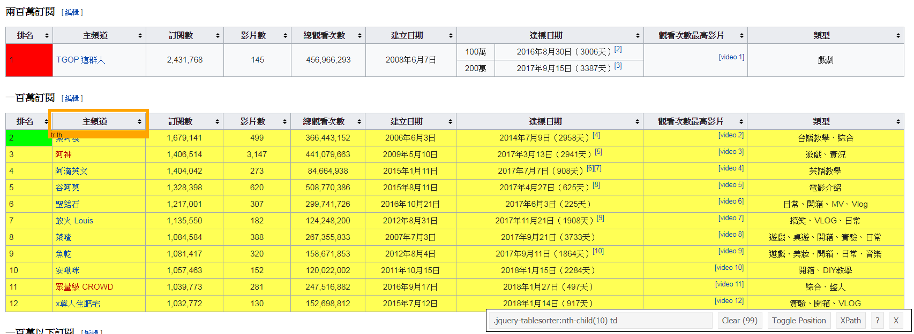

```{r setup, include=FALSE}
knitr::opts_chunk$set(echo = TRUE)
```

## 主題訂定

### 數位化趨勢下的新興職業

- [9 個月收入破 340 萬！22 歲 YouTuber 小玉拍片自爆年收](https://www.inside.com.tw/2017/11/27/youtuber-yu-revealed-his-income)

- [世大運網紅行銷有沒有效？最強網紅又是誰？](https://www.bnext.com.tw/article/45655/2017-summer-universiadg-internet-celebrity-marketing)

### 可能的資料來源

- [台灣YouTuber訂閱人數排行榜](https://zh.wikipedia.org/wiki/%E5%8F%B0%E7%81%A3YouTuber%E8%A8%82%E9%96%B1%E4%BA%BA%E6%95%B8%E6%8E%92%E8%A1%8C%E6%A6%9C)

- [Top YouTuber channels from Taiwan](https://socialblade.com/youtube/top/country/tw/mostsubscribed)

## 網頁爬蟲的輔助工具

### SelectorGadget

SelectorGadget 是 Chrome 的一個擴充功能，可以用來輔助定位所選擇網頁元素的 CSS 選擇器。
可透過 Chrome 瀏覽器右上角的自訂及管理選單 -> 更多工具 -> 擴充功能 -> 取得更多擴充功能 -> 搜尋 SelectorGadget 進行安裝。

使用方法：

1. 開啟 SelectorGadget 工具，點擊目標元素。
2. 綠色表示點擊的元素；黃色表示符合相同 CSS 選擇器規則的元素；橘色表示其他可新增的元素；紅色表示可排除的元素。
3. 產生的 CSS 選擇器或是 XPath 即可直接複製套用。



## R 語言網頁爬蟲

```{r, warning=FALSE}
## 安裝並載入套件
# install.packages("rvest")
library(rvest)

## 指定目標網頁網址
url = "https://zh.wikipedia.org/wiki/%E5%8F%B0%E7%81%A3YouTuber%E8%A8%82%E9%96%B1%E4%BA%BA%E6%95%B8%E6%8E%92%E8%A1%8C%E6%A6%9C"

## 讀取網頁內容
wiki_page = read_html(url)

## 根據 CSS Selector 獲取節點資訊
channel_node = html_nodes(wiki_page, css="td > a")

## 擷取超連結文字
html_text(channel_node)

## 根據 CSS Selector 獲取節點資訊
table_node = html_nodes(wiki_page, css="h2+ .wikitable")

## 擷取表格內容
#html_table(table_node, header=TRUE)
```

## 期末報告主題及資料來源訂定

[表單填寫](https://docs.google.com/spreadsheets/d/1V448OuxTlP3pE7Byx8C6dQuOYpFiCm2O4KOyEozsyf8/edit?usp=sharing)
