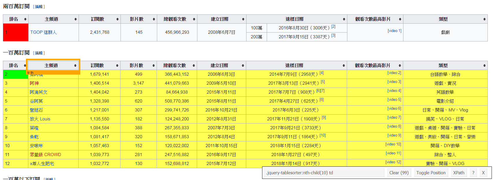

主題訂定與資料蒐集
================

主題訂定
--------

### 數位化趨勢下的新興職業

-   [9 個月收入破 340 萬！22 歲 YouTuber 小玉拍片自爆年收](https://www.inside.com.tw/2017/11/27/youtuber-yu-revealed-his-income)

-   [世大運網紅行銷有沒有效？最強網紅又是誰？](https://www.bnext.com.tw/article/45655/2017-summer-universiadg-internet-celebrity-marketing)

### 可能的資料來源

-   [台灣YouTuber訂閱人數排行榜](https://zh.wikipedia.org/wiki/%E5%8F%B0%E7%81%A3YouTuber%E8%A8%82%E9%96%B1%E4%BA%BA%E6%95%B8%E6%8E%92%E8%A1%8C%E6%A6%9C)

-   [Top YouTuber channels from Taiwan](https://socialblade.com/youtube/top/country/tw/mostsubscribed)

網頁爬蟲的輔助工具
------------------

### SelectorGadget

SelectorGadget 是 Chrome 的一個擴充功能，可以用來輔助定位所選擇網頁元素的 CSS 選擇器。 可透過 Chrome 瀏覽器右上角的自訂及管理選單 -&gt; 更多工具 -&gt; 擴充功能 -&gt; 取得更多擴充功能 -&gt; 搜尋 SelectorGadget 進行安裝。

使用方法：

1.  開啟 SelectorGadget 工具，點擊目標元素。
2.  綠色表示點擊的元素；黃色表示符合相同 CSS 選擇器規則的元素；橘色表示其他可新增的元素；紅色表示可排除的元素。
3.  產生的 CSS 選擇器或是 XPath 即可直接複製套用。



R 語言網頁爬蟲
--------------

``` r
## 安裝並載入套件
# install.packages("rvest")
library(rvest)
```

    ## Loading required package: xml2

``` r
library(XML)
```

    ## 
    ## Attaching package: 'XML'

    ## The following object is masked from 'package:rvest':
    ## 
    ##     xml

``` r
## 指定目標網頁網址
url = "https://zh.wikipedia.org/wiki/台灣YouTuber訂閱人數排行榜"

## 讀取網頁內容
wiki_page = read_html(url)

## 根據 CSS Selector 獲取節點資訊
channel_node = html_nodes(wiki_page, css="td > a")

## 擷取超連結文字
html_text(channel_node)
```

    ##  [1] "TGOP 這群人"                      "蔡阿嘎"                          
    ##  [3] "阿神"                             "阿滴英文"                        
    ##  [5] "谷阿莫"                           "聖結石"                          
    ##  [7] "放火 Louis"                       "菜喳"                            
    ##  [9] "魚乾"                             "安啾咪"                          
    ## [11] "眾量級 CROWD"                     "x尊人生肥宅"                     
    ## [13] "小玉"                             "老皮"                            
    ## [15] "白癡公主"                         "舞秋風"                          
    ## [17] "噪咖EBCbuzz"                      "Stopkiddinstudio"                
    ## [19] "sandy mandy"                      "counter656"                      
    ## [21] "古娃娃WawaKu"                     "DE JuN"                          
    ## [23] "巧克力"                           "頑GAME"                          
    ## [25] "Joeman"                           "黃阿瑪的後宮生活"                
    ## [27] "How Fun"                          "the劉沛"                         
    ## [29] "Hello Catie"                      "聖嫂 DODO"                       
    ## [31] "巢哥"                             "啾啾鞋"                          
    ## [33] "臺灣吧Taiwan Bar"                 "鬼鬼"                            
    ## [35] "翔麟"                             "Jasper 星培"                     
    ## [37] "小白"                             "這群人 展榮展瑞 Keelong and Rays"
    ## [39] "超粒方"                           "MaoMao TV"                       
    ## [41] "在不瘋狂就等死"                   "三原慧悟 Sanyuan_JAPAN"          
    ## [43] "WACKYBOYS 反骨男孩"               "NyoNyoTV妞妞TV"                  
    ## [45] "冏星人"                           "皮老"                            
    ## [47] "GINA HELLO!"                      "JerryFish Yang"                  
    ## [49] "黑男"                             "馬叔叔 UNCLE MA"                 
    ## [51] "蔡阿嘎"                           "這群人"                          
    ## [53] "聖結石"                           "人生肥宅 x尊"                    
    ## [55] "谷阿莫"                           "魚乾"                            
    ## [57] "<U+7EF4>基共享<U+8D44>源"

``` r
## 根據 CSS Selector 獲取節點資訊
table_node = html_nodes(wiki_page, css=".wikitable:nth-child(8)")

## 擷取表格內容
#html_table(table_node, header=TRUE)
readHTMLTable(as.character(table_node), encoding="UTF-8")[[1]]
```

    ##      V1                         V2        V3   V4          V5           V6
    ## 1     1                TGOP 這群人 2,431,768  145 456,966,293 2008年6月7日
    ## 2 200萬 2017年9月15日（3387天）[3]      <NA> <NA>        <NA>         <NA>
    ##      V7                         V8        V9  V10
    ## 1 100萬 2016年8月30日（3006天）[2] [video 1] 戲劇
    ## 2  <NA>                       <NA>      <NA> <NA>

期末報告主題及資料來源訂定
--------------------------

[表單填寫](https://docs.google.com/spreadsheets/d/1V448OuxTlP3pE7Byx8C6dQuOYpFiCm2O4KOyEozsyf8/edit?usp=sharing)
