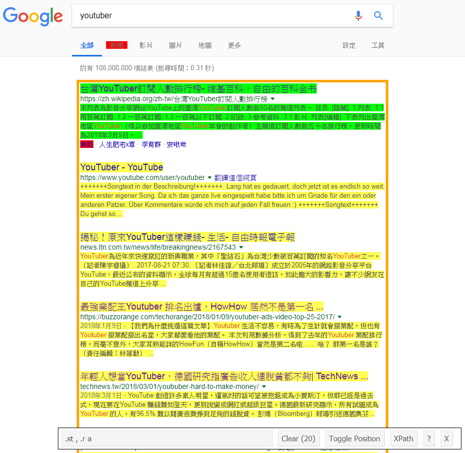
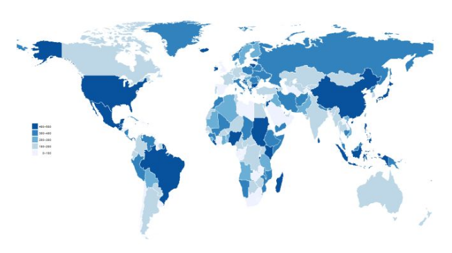
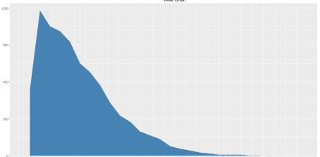
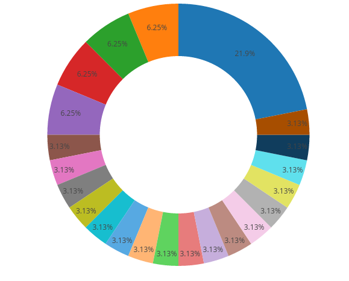
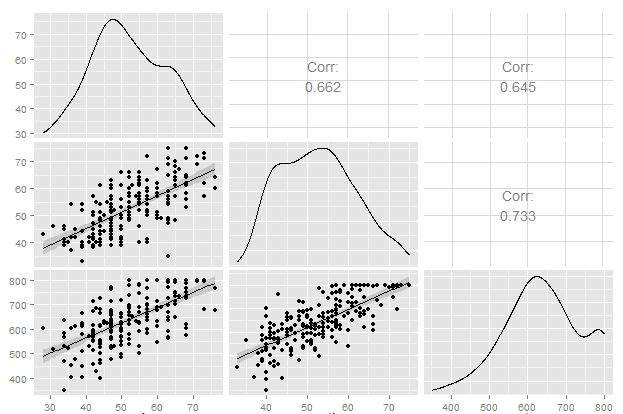

```{r setup, include=FALSE}
knitr::opts_chunk$set(echo = TRUE)
```

## 資料蒐集方式

- 調查資料：例如[問卷](https://goo.gl/forms/9dgo5a9fIqAS0T8Q2)([回應](https://docs.google.com/spreadsheets/d/1tGQHE3rO-KAyHNDkrIMoWDOuG7MVdH6uabMatruUEKo/edit?usp=sharing))。
- 爬蟲資料：例如論壇、新聞網等一般網頁資訊。
- 開放資料：例如[政府資料開放平臺](https://data.gov.tw/)。
- API 串接：例如[Facebook](https://developers.facebook.com/)。


## Google Search 爬蟲

### 瞭解網址格式

- [Google Search Appliance Documentation: Search Parameters](https://www.google.com/support/enterprise/static/gsa/docs/admin/72/gsa_doc_set/xml_reference/request_format.html#1086546)


### SelectorGadget




### R code

```{r, warning=FALSE}
## 載入 rvest 套件
library(rvest)

## 指定附加參數的爬蟲目標網址
url = "https://www.google.com.tw/search?q=youtuber&num=50&lr=lang_zh-TW"

## 指定文字編碼讀取頁面
search_page = read_html(url, encoding="CP950")

## 根據 CSS 選擇器規則獲取目標 nodes
search_node = html_nodes(search_page, css=".st , .r a")

## 擷取爬蟲結果的文字部分
search_result = html_text(search_node)

## 檢視頭幾筆資料
head(search_result)
```


## 斷詞

### 中文斷詞

一般而言英文斷詞較為單純，但是還是會有一些資料清理的動作。
例如去除連續空格、去除標點符號或數字、大小寫轉換、停止詞處理、詞幹轉換等等。

而中文的斷詞相較之下就複雜得多，通常需要靠詞庫的對應來進行。
在 R 中常用的中文斷詞套件包括 Rwordseg 及 jiebaR，
其中 Rwordseg 使用的是 Java 的 Ansj 斷詞系統；而 jiebaR 則是開源中文斷詞引擎 Jieba 的 R 語言版本。

以下使用 jiebaR 進行中文斷詞示範：

### R code

```{r, warning=FALSE}
## 安裝並載入 jiebaR 套件
# install.packages("jiebaR")
library(jiebaR)

## 建立一個分詞器
wk = worker()

## 進行斷詞
seg = segment(search_result, wk)
# seg = wk[search_result]
# seg = wk <= search_result

## 檢視斷詞的前 100 筆結果
head(seg, 100)
```


## 確立分析方向

- 以 Youtuber 主題為例：


### 熱門議題關鍵字

```{r, warning=FALSE, message=FALSE, echo=FALSE}
library(wordcloud)
f = freq(seg)
wordcloud(f$char, f$freq, min.freq=5, colors=rainbow(1000))
```


### 主要地區分布




### 成長趨勢




### 頻道分類概況




### 訂閱數 vs 影片數 vs 瀏覽量



