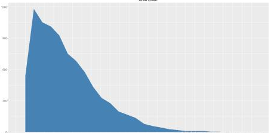
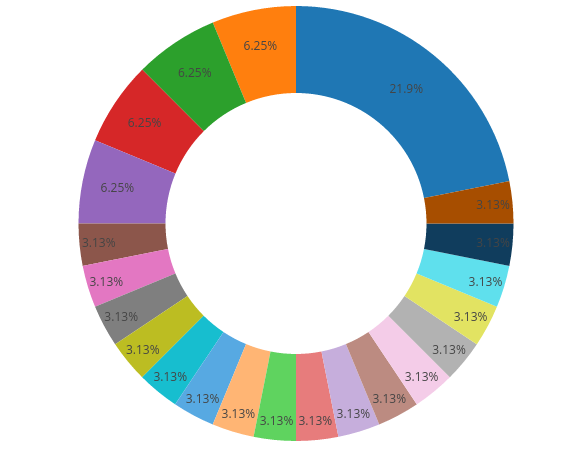
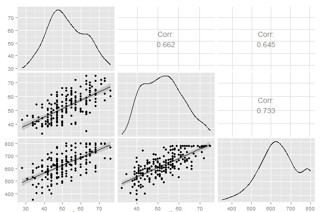

爬蟲、斷詞、分析方向
================

資料蒐集方式
------------

-   調查資料：例如[問卷](https://goo.gl/forms/9dgo5a9fIqAS0T8Q2)([回應](https://docs.google.com/spreadsheets/d/1tGQHE3rO-KAyHNDkrIMoWDOuG7MVdH6uabMatruUEKo/edit?usp=sharing))。
-   爬蟲資料：例如論壇、新聞網等一般網頁資訊。
-   開放資料：例如[政府資料開放平臺](https://data.gov.tw/)。
-   API 串接：例如[Facebook](https://developers.facebook.com/)。

Google Search 爬蟲
------------------

### 瞭解網址格式

-   [Google Search Appliance Documentation: Search Parameters](https://www.google.com/support/enterprise/static/gsa/docs/admin/72/gsa_doc_set/xml_reference/request_format.html#1086546)

### SelectorGadget


### R code

``` r
## 載入 rvest 套件
library(rvest)
```

    ## Loading required package: xml2

``` r
## 指定附加參數的爬蟲目標網址
url = "https://www.google.com.tw/search?q=youtuber&num=50&lr=lang_zh-TW"

## 指定文字編碼讀取頁面
search_page = read_html(url, encoding="CP950")

## 根據 CSS 選擇器規則獲取目標 nodes
search_node = html_nodes(search_page, css=".st , .r a")

## 擷取爬蟲結果的文字部分
search_result = html_text(search_node)

## 檢視頭幾筆資料
head(search_result)
```

    ## [1] "台灣YouTuber訂閱人數排行榜- <U+7EF4>基百科，自由的百科全<U+4E66>"                                                                                                                                                                                                                                                                
    ## [2] "本列表為影音分享網站YouTube上的臺灣YouTuber訂閱人數前50名的頻道列表。 \n目<U+5F55>. [<U+9690>藏]. 1 列表. 1.1 兩百萬訂閱; 1.2 一百萬訂閱; 1.3 一百萬以下訂閱. 2 紀錄; 3 \n參考資料. 3.1 影片. 列表[<U+7F16><U+8F91>]. 下表列出臺灣地區YouTuber（得以參加臺灣地區YouTuber年會的創作者）主頻道訂閱人數前五十名排行榜，更新時間為2018年3月9\n日，<U+00A0>..."
    ## [3] "「youtuber」的新聞搜尋結果"                                                                                                                                                                                                                                                                                                      
    ## [4] "YouTube創造許多素人明星，運氣好的話可望被挖掘成為小賈斯汀，但那已經是過去\n式，現在要在YouTube賺錢難如登天，更別說變成網紅或超級巨星。德國最新研究\n顯示，所有試圖成為YouTuber的人，有96.5%難以藉廣告費掙到足夠的錢脫貧。"                                                                                                       
    ## [5] "YouTuber - <U+7EF4>基百科，自由的百科全<U+4E66>"                                                                                                                                                                                                                                                                                 
    ## [6] "YouTuber也稱為YouTube名人，是指專門在YouTube平臺上傳影片的网<U+7EDC>名人及攝\n錄者。 目<U+5F55>. [<U+9690>藏]. 1 名稱由來; 2 職業收入; 3 文化; 4 知名YouTuber. 4.1 臺灣; 4.2 \n日本; 4.3 歐美; 4.4 香港. 5 參見; 6 外部連結. 名稱由來[<U+7F16><U+8F91>]. YouTuber一詞源自於\nYouTube與英語詞尾\"er\"(表某職業之意)組成。 意指透過YouTube進行職業工作的人\n<U+00A0>..."

斷詞
----

### 中文斷詞

一般而言英文斷詞較為單純，但是還是會有一些資料清理的動作。 例如去除連續空格、去除標點符號或數字、大小寫轉換、停止詞處理、詞幹轉換等等。

而中文的斷詞相較之下就複雜得多，通常需要靠詞庫的對應來進行。 在 R 中常用的中文斷詞套件包括 Rwordseg 及 jiebaR， 其中 Rwordseg 使用的是 Java 的 Ansj 斷詞系統；而 jiebaR 則是開源中文斷詞引擎 Jieba 的 R 語言版本。

以下使用 jiebaR 進行中文斷詞示範：

### R code

``` r
## 安裝並載入 jiebaR 套件
# install.packages("jiebaR")
library(jiebaR)
```

    ## Loading required package: jiebaRD

``` r
## 建立一個分詞器
wk = worker()

## 進行斷詞
seg = segment(search_result, wk)
# seg = wk[search_result]
# seg = wk <= search_result

## 檢視斷詞的前 100 筆結果
head(seg, 100)
```

    ##   [1] "台灣"     "YouTuber" "訂閱"     "人數"     "排行榜"   "<U+7EF4>基百科"
    ##   [7] "自由"     "的"       "百科全<U+4E66>" "本"       "列表"     "為"      
    ##  [13] "影音"     "分享"     "網站"     "YouTube"  "上"       "的"      
    ##  [19] "臺灣"     "YouTuber" "訂閱"     "人數"     "前"       "50"      
    ##  [25] "名"       "的"       "頻道"     "列表"     "目<U+5F55>" "<U+9690>藏"
    ##  [31] "1"        "列表"     "1.1"      "兩百萬"   "訂閱"     "1.2"     
    ##  [37] "一百萬"   "訂閱"     "1.3"      "一百萬"   "以下"     "訂閱"    
    ##  [43] "2"        "紀錄"     "3"        "參考資料" "3.1"      "影片"    
    ##  [49] "列表"     "<U+7F16><U+8F91>" "下"       "表列出"   "臺灣地區" "YouTuber"
    ##  [55] "得以"     "參加"     "臺灣地區" "YouTuber" "年會"     "的"      
    ##  [61] "創作者"   "主"       "頻道"     "訂閱"     "人數"     "前"      
    ##  [67] "五十名"   "排行榜"   "更新"     "時間"     "為"       "2018"    
    ##  [73] "年"       "3"        "月"       "9"        "日"       "youtuber"
    ##  [79] "的"       "新聞"     "搜尋"     "結果"     "YouTube"  "創造"    
    ##  [85] "許多"     "素人"     "明星"     "運氣"     "好"       "的話"    
    ##  [91] "可望"     "被"       "挖掘"     "成為"     "小"       "賈"      
    ##  [97] "斯汀"     "但"       "那"       "已經"

確立分析方向
------------

-   以 Youtuber 主題為例：

### 熱門議題關鍵字


### 主要地區分布


### 成長趨勢



### 頻道分類概況



### 訂閱數 vs 影片數 vs 瀏覽量


