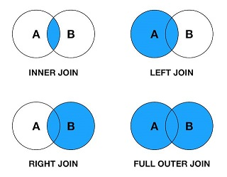

資料清理
================

補充
----

-   [Youtuber 相關資料爬蟲程式參考](youtuber_crawler.md)

R 好用的資料整理套件 - dplyr
----------------------------

dplyr 套件由 [Hadley Wickham](http://hadley.nz/) 所開發，是目前 R 語言中最常被使用在資料預處理的熱門套件之一。

其特色是將 R 原生的資料處理方法匯整成一些簡單直覺的函數，且絕大部分函數使用方式皆具有相同邏輯，使用上相對容易。同時也支援 pipeline 語法，因此可以將資料清理流程以直觀的方式撰寫，對於程式碼的可讀性也有所幫助。

### pipeline 語法

-   以串流的方式來處理資料的運算，讓程式碼增加可讀性。
-   將左側的物件傳遞給右側的函數使用，並回傳右側函數的結果。


``` r
## 安裝並載入 dplyr 套件
# install.packages("dplyr")
library(dplyr)

## 取出 iris 資料集的前 10 筆資料繪製散佈圖
iris %>%
  head(10) %>%
  plot()
```


### mutate, filter

-   mutate: 建立或修改欄位變數。
-   filter: 篩選符合條件的資料。第一個參數放資料，第二個參數之後放條件判斷式。

``` r
## 讀取抓取下來的資料檔
youtuber = readRDS("20180319_files/youtuber.rds")

## 將 UPLOADS, SUBSCRIBERS, VIEWS 三個欄位的值先去掉逗號，再轉換為數值型態
## 接著篩選掉資料不合理或是不完整的部分
youtuber = youtuber %>%
  mutate(
    UPLOADS = as.numeric(gsub(",", "", UPLOADS)),
    SUBSCRIBERS = as.numeric(gsub(",", "", SUBSCRIBERS)),
    VIEWS = as.numeric(gsub(",", "", VIEWS))
  ) %>%
  filter(
    UPLOADS > 0,
    SUBSCRIBERS > 0,
    VIEWS > 0,
    COUNTRY != "",
    TYPE != ""
  )

## 檢視前幾筆資料內容
head(youtuber)
```

    ##   UPLOADS SUBSCRIBERS       VIEWS COUNTRY          TYPE        CREATED
    ## 1    3442    61428357 17325146652      US        Comedy Apr 29th, 2010
    ## 2   12108    38489148 33246553747      IN         Music Mar 13th, 2006
    ## 3     123    34402820 17061613038      US         Music Sep 26th, 2009
    ## 4     137    33444915  3432607306      CL Entertainment  Sep 8th, 2011
    ## 5     661    29314080 14349657902      BR         Music Mar 21st, 2012
    ## 6     116    28785746 12511258814      GB         Music  Aug 8th, 2006

### select, distinct

-   select: 選擇/排除指定的欄位，使用減號(-)表示排除。
-   distinct: 去重複。

``` r
## 安裝並載入 maps 套件
## 這邊只是要用到 maps 套件內建的 ISO 國家代碼資料
# install.packages("maps")
library(maps)

## 僅挑選 a2, ISOname, mapname 三個欄位
## 針對 a2 欄位去重複，若有重複則保留其他欄位的第一筆資料
iso = iso3166 %>%
  select(a2, ISOname, mapname) %>%
  distinct(a2, .keep_all=TRUE)

## 檢視前幾筆資料內容
head(iso)
```

    ##   a2       ISOname               mapname
    ## 1 AW         Aruba                 Aruba
    ## 2 AF   Afghanistan           Afghanistan
    ## 3 AO        Angola                Angola
    ## 4 AI      Anguilla              Anguilla
    ## 5 AX Aland Islands Finland:Aland Islands
    ## 6 AL       Albania               Albania

### join

-   join: 將兩資料針對特定欄位變數進行串聯，常用的 join 方法又包含以下四種。
    1.  inner\_join(x, y, by, ...)
    2.  left\_join(x, y, by, ...)
    3.  right\_join(x, y, by, ...)
    4.  full\_join(x, y, by, ...)



``` r
## 將 youtuber 及 iso 透過兩碼的國家代碼進行比對串聯
youtuber = youtuber %>%
  left_join(iso, by=c("COUNTRY"="a2"))

## 檢視前幾筆資料內容
head(youtuber)
```

    ##   UPLOADS SUBSCRIBERS       VIEWS COUNTRY          TYPE        CREATED
    ## 1    3442    61428357 17325146652      US        Comedy Apr 29th, 2010
    ## 2   12108    38489148 33246553747      IN         Music Mar 13th, 2006
    ## 3     123    34402820 17061613038      US         Music Sep 26th, 2009
    ## 4     137    33444915  3432607306      CL Entertainment  Sep 8th, 2011
    ## 5     661    29314080 14349657902      BR         Music Mar 21st, 2012
    ## 6     116    28785746 12511258814      GB         Music  Aug 8th, 2006
    ##                                                ISOname mapname
    ## 1                                        United States     USA
    ## 2                                                India   India
    ## 3                                        United States     USA
    ## 4                                                Chile   Chile
    ## 5                                               Brazil  Brazil
    ## 6 United Kingdom of Great Britain and Northern Ireland UK(?!r)

### group\_by, summarise, arrange

-   group\_by: 根據指定的欄位變數進行資料分組。
-   summarise: 匯整計算，通常會與 group\_by 一起搭配使用。
-   arrange: 依照指定的變數欄位進行資料排序，預設為升冪排序，使用 desc 函數可降冪排序。

``` r
## 依照 TYPE 對資料進行分組
## 對各組進行彙整，新增一個 avg_sub 欄位計算各組 SUBSCRIBERS 平均數
## 依照 avg_sub 由小至大排序
youtuber %>%
  group_by(TYPE) %>%
  summarise(avg_sub = mean(SUBSCRIBERS)) %>%
  arrange(avg_sub)
```

    ## # A tibble: 16 x 2
    ##    TYPE          avg_sub
    ##    <fctr>          <dbl>
    ##  1 Travel        1549187
    ##  2 Autos         1883633
    ##  3 Animals       2319198
    ##  4 Film          2366859
    ##  5 Education     2426066
    ##  6 People        2511423
    ##  7 Howto         2747624
    ##  8 Entertainment 2882119
    ##  9 Games         2931806
    ## 10 Tech          3028213
    ## 11 News          3044553
    ## 12 Sports        3506614
    ## 13 Comedy        3573961
    ## 14 Music         3820599
    ## 15 Nonprofit     4273712
    ## 16 Shows         4523418
