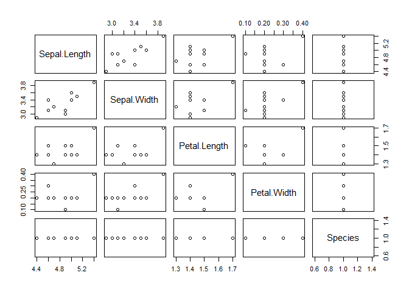

資料清理
================

補充
----

-   [Youtuber 相關資料爬蟲程式參考](youtuber_crawler.md)

R 好用的資料整理套件 - dplyr
----------------------------

介紹

### pipeline 語法

-   以串流的方式來處理資料的運算，讓程式碼增加可讀性。
-   將左側的物件傳遞給右側的函數使用，並回傳右側函數的結果。


``` r
## 安裝並載入 dplyr 套件
# install.packages("dplyr")
library(dplyr)
```

    ## 
    ## Attaching package: 'dplyr'

    ## The following objects are masked from 'package:stats':
    ## 
    ##     filter, lag

    ## The following objects are masked from 'package:base':
    ## 
    ##     intersect, setdiff, setequal, union

``` r
## 取出 iris 資料集的前 10 筆資料繪製散佈圖
iris %>%
  head(10) %>%
  plot()
```



### mutate, filter

### select, distinct

### join

### group\_by, summarise, arrange
