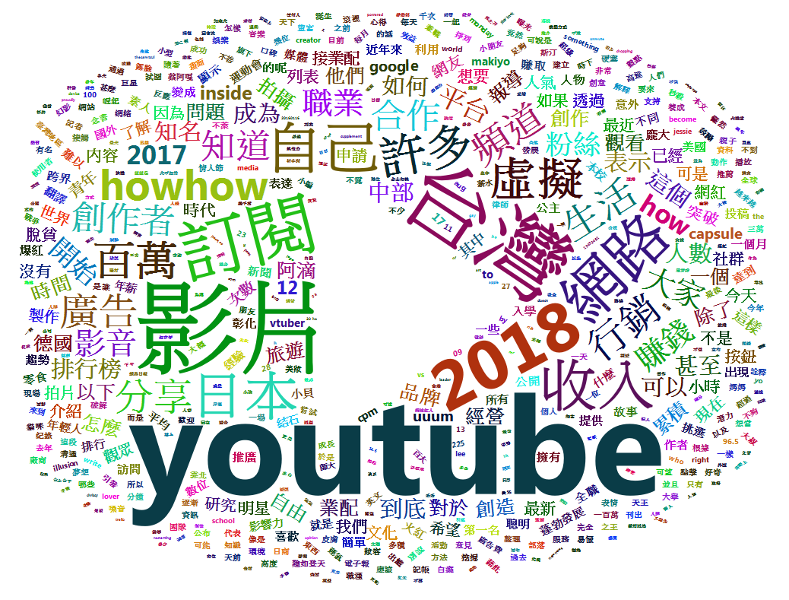

文本分析 - 文字雲
================

文字雲
------

文字雲是呈現詞彙熱門程度(出現頻率)最直觀的方法。

### wordcloud 套件

wordcloud() 函數常用參數：

-   words: 要繪製文字雲的詞彙
-   freq: 詞彙對應的頻率(次數)
-   min.freq: 指定詞彙要出現在圖上的最低次數
-   max.words: 指定圖形最多可以出現多少詞彙，超過的從頻率低的刪除
-   colors: 顏色(由頻率低至頻率高)

``` r
## 讀取詞頻物件
tf = readRDS("20180416_files/tf.rds")

## 安裝並載入 wordcloud 套件
# install.package("wordcloud")
library(wordcloud)
```

    ## Loading required package: RColorBrewer

``` r
## 繪製文字雲
wordcloud(tf$char, tf$freq, min.freq=5, colors=rainbow(1000))
```


### wordcloud2 套件

wordcloud2 透過 JavaScript 呈現動態的文字雲。 由於現在發佈的版本在某些功能(例如自定義圖型)有些問題，因此建議直接透過 devtools::install\_github 安裝開發版本。

wordcloud2() 函數常用參數：

-   data: 包含詞彙跟頻率(次數)的資料
-   fontFamily: 字體
-   color: 文字顏色，內建關鍵字'random-dark'及'randon-light'
-   backgroundColor: 背景顏色
-   shape: 圖型(circle, cardioid, diamond, triangle-forward, triangle, pentagon, star)
-   figPath: 自定義圖型路徑，欲呈現區域需為黑色

``` r
## 安裝並載入 wordcloud2 套件
# install.package("wordcloud2")
# 或
# install.packages("devtools")
# library(devtools)
# install_github("lchiffon/wordcloud2")
library(wordcloud2)

## 繪製文字雲
wordcloud2(tf, fontFamily="微軟正黑體", color="random-light", backgroundColor="grey")
```


``` r
## 自定義圖型
wordcloud2(tf, figPath="20180416_files/youtube.png")
```



``` r
## 文字圖型
letterCloud(tf, "YouTube")
```


期末口頭報告
------------

-   報告日期：5/14(統一繳交簡報檔), 5/21
-   簡報順序：[連結](https://docs.google.com/spreadsheets/d/1V448OuxTlP3pE7Byx8C6dQuOYpFiCm2O4KOyEozsyf8/edit?usp=sharing)
-   簡報時間：每人報告時間10分鐘以內，開放發問時間5分鐘以內
-   內容要求：主題背景介紹、分析方向描述、使用資料簡介、分析方法說明、分析結果解釋、後續精進方向
-   評分標準：內容完整度 &gt; 分析及解釋正確性 &gt; 主題洞察 &gt; 簡報製作及現場報告表現
