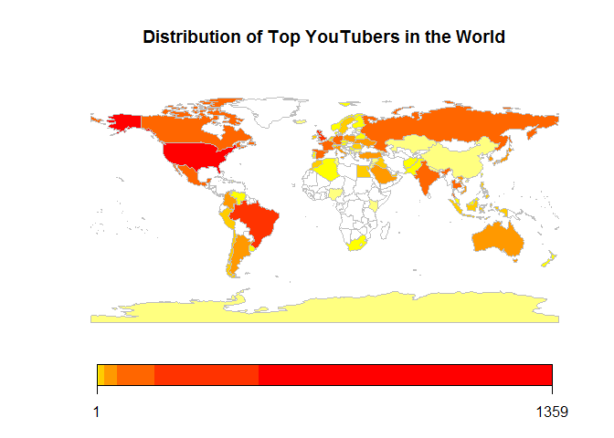
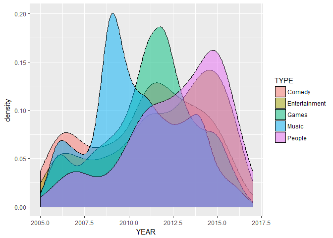
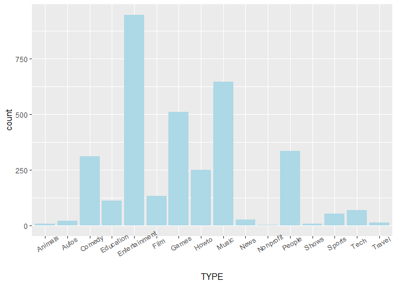
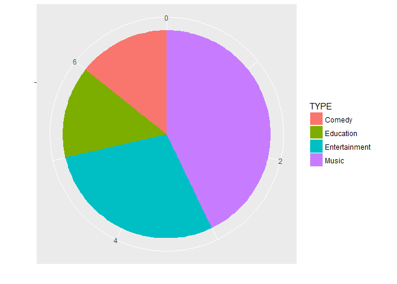
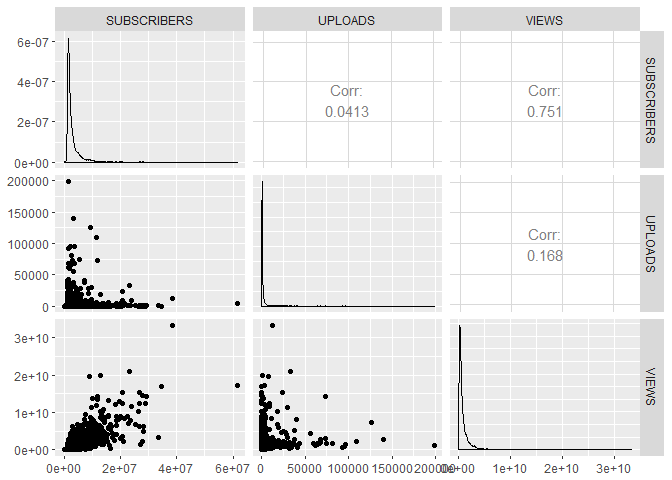

資料視覺化
================

確立分析方向
------------

延續 3/12 的[講義內容](https://github.com/ytshen1207/1062SHU/blob/master/20180312/20180312.md)，我們的分析方向將包括熱門議題關鍵字([4/16](https://github.com/ytshen1207/1062SHU/tree/master/20180416))、主要地區分布、成長趨勢、頻道分類概況、訂閱數 vs 影片數 vs 瀏覽量。

視覺化呈現
----------

### 讀取資料檔

``` r
library(dplyr)
youtuber = readRDS("20180423_files/youtuber.rds")
```

### 主要地區分布

``` r
## 安裝並載入 rworldmap 套件
# install.packages("rworldmap")
library(rworldmap)
```

    ## Loading required package: sp

    ## ### Welcome to rworldmap ###

    ## For a short introduction type :   vignette('rworldmap')

``` r
## 計算各國家 youtuber 出現在 top 5000 的次數
df_map = youtuber %>%
  group_by(COUNTRY) %>%
  summarise(COUNT = n())

## 透過 rworldmap 的 joinCountryData2Map 函數轉換為地圖的繪圖的資料型態
map_data = joinCountryData2Map(df_map,
                               joinCode = "ISO2",
                               nameJoinColumn = "COUNTRY")
```

    ## 82 codes from your data successfully matched countries in the map
    ## 0 codes from your data failed to match with a country code in the map
    ## 159 codes from the map weren't represented in your data

``` r
## 繪製地圖
mapCountryData(map_data,
               nameColumnToPlot = "COUNT",
               catMethod = "logFixedWidth",
               mapTitle = "Distribution of Top YouTubers in the World")
```



### 成長趨勢

``` r
## 載入 ggplot2 套件
library(ggplot2)

## 篩選有興趣的頻道類別，依年份繪製各分類頻道的趨勢分布，並設定透明度 alpha
youtuber %>%
  filter(TYPE %in% c("Comedy","Entertainment","Games","Music","People")) %>%
  ggplot(aes(YEAR, fill=TYPE)) +
  geom_density(alpha=0.5)
```



### 頻道分類概況

``` r
## 所有頻道次數長條圖
youtuber %>%
  ggplot(aes(TYPE)) +
  geom_bar(fill="lightblue") +
  theme(axis.text.x = element_text(angle=30))
```



``` r
## 台灣頻道類型圓餅圖
youtuber %>%
  filter(mapname == "Taiwan") %>%
  ggplot(aes(x="", fill=TYPE)) +
  geom_bar(width=1) +
  coord_polar("y") +
  labs(x="", y="")
```



### 訂閱數 vs 影片數 vs 瀏覽量

``` r
## 載入 GGally 套件
library(GGally)
```

    ## 
    ## Attaching package: 'GGally'

    ## The following object is masked from 'package:dplyr':
    ## 
    ##     nasa

``` r
## 繪製散佈圖
youtuber %>%
  select(SUBSCRIBERS, UPLOADS, VIEWS) %>%
  ggpairs()
```


