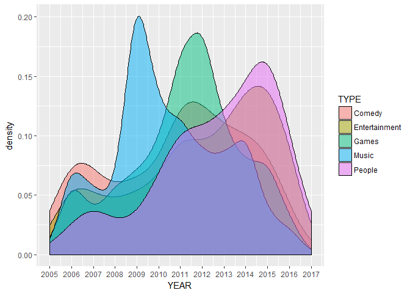
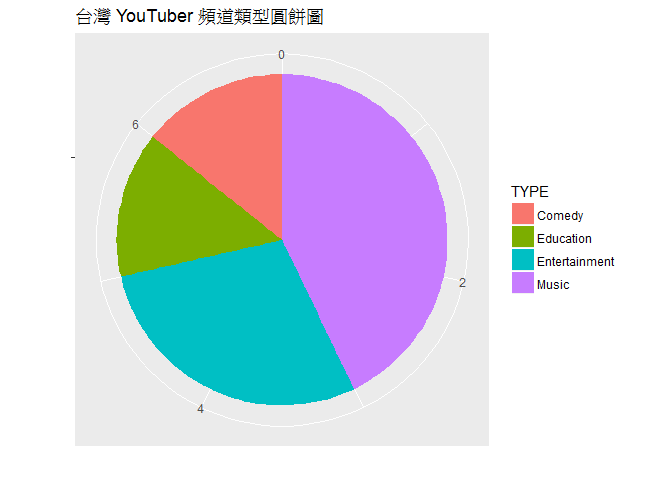
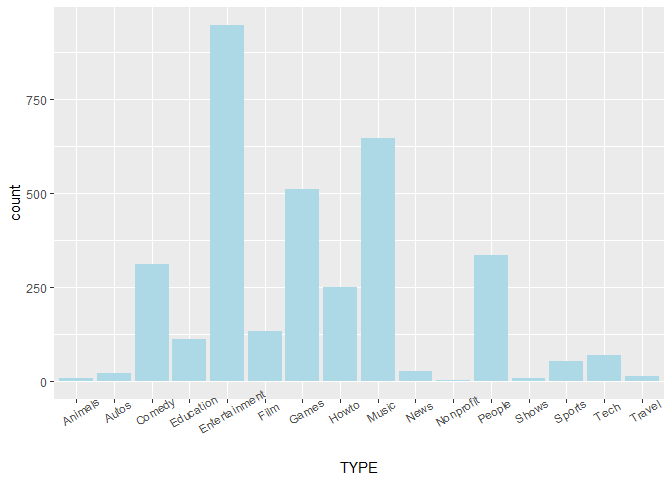
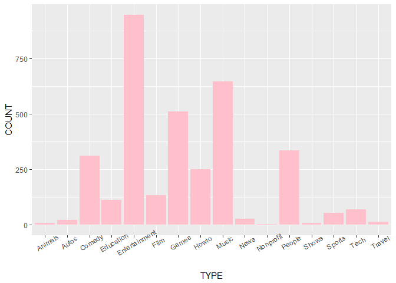

綜合討論
================

問題討論
--------

### 讀取資料檔

``` r
library(dplyr)
library(ggplot2)
youtuber = readRDS("20180430_files/youtuber.rds")
```

### 座標軸刻度

可使用 scale\_x\_continuous() 函數

``` r
youtuber %>%
  filter(TYPE %in% c("Comedy","Entertainment","Games","Music","People")) %>%
  ggplot(aes(YEAR, fill=TYPE)) +
  geom_density(alpha=0.5) +
  scale_x_continuous(breaks=2005:2017)
```



### Mac 中文字體

可使用 theme(text=element\_text(family="字體"))

``` r
youtuber %>%
  filter(mapname == "Taiwan") %>%
  ggplot(aes(x="", fill=TYPE)) +
  geom_bar(width=1) +
  coord_polar("y") +
  labs(title="台灣 YouTuber 頻道類型圓餅圖", x="", y="") +
  theme(text = element_text(family="STKaiti"))
```



### 繪圖的資料型態

-   未經次數彙整的原始資料

``` r
head(youtuber)
```

    ##   UPLOADS SUBSCRIBERS       VIEWS COUNTRY          TYPE        CREATED
    ## 1    3442    61428357 17325146652      US        Comedy Apr 29th, 2010
    ## 2   12108    38489148 33246553747      IN         Music Mar 13th, 2006
    ## 3     123    34402820 17061613038      US         Music Sep 26th, 2009
    ## 4     137    33444915  3432607306      CL Entertainment  Sep 8th, 2011
    ## 5     661    29314080 14349657902      BR         Music Mar 21st, 2012
    ## 6     116    28785746 12511258814      GB         Music  Aug 8th, 2006
    ##                                                ISOname mapname n_char YEAR
    ## 1                                        United States     USA     14 2010
    ## 2                                                India   India     14 2006
    ## 3                                        United States     USA     14 2009
    ## 4                                                Chile   Chile     13 2011
    ## 5                                               Brazil  Brazil     14 2012
    ## 6 United Kingdom of Great Britain and Northern Ireland UK(?!r)     13 2006

``` r
youtuber %>%
  ggplot(aes(TYPE)) +
  geom_bar(fill="lightblue") +
  theme(axis.text.x = element_text(angle=30))
```



-   經次數彙整的次級資料

``` r
youtuber2 = youtuber %>%
  group_by(TYPE) %>%
  summarise(COUNT = n())

head(youtuber2)
```

    ## # A tibble: 6 x 2
    ##   TYPE          COUNT
    ##   <fct>         <int>
    ## 1 Animals          10
    ## 2 Autos            21
    ## 3 Comedy          311
    ## 4 Education       113
    ## 5 Entertainment   948
    ## 6 Film            133

``` r
youtuber2 %>%
  ggplot(aes(x=TYPE, y=COUNT)) +
  geom_bar(stat="identity", fill="pink") +
  theme(axis.text.x = element_text(angle=30))
```



常見統計謬誤
------------

-   資料
-   方法
-   解讀
