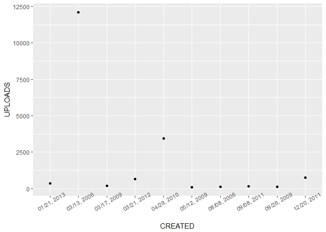
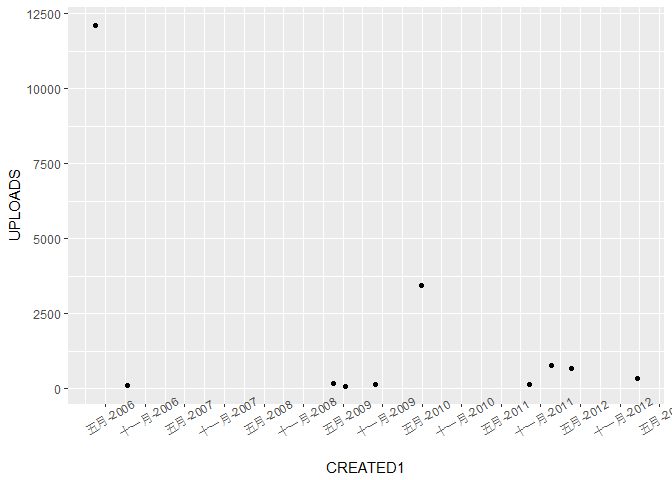
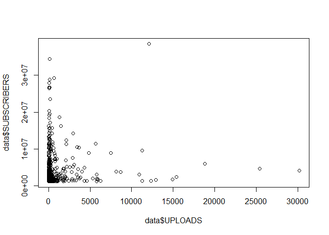
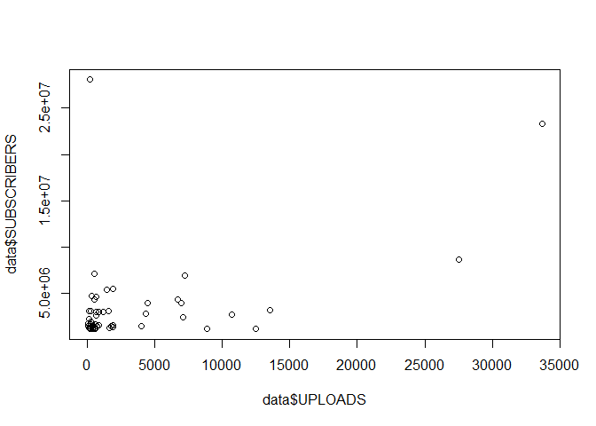
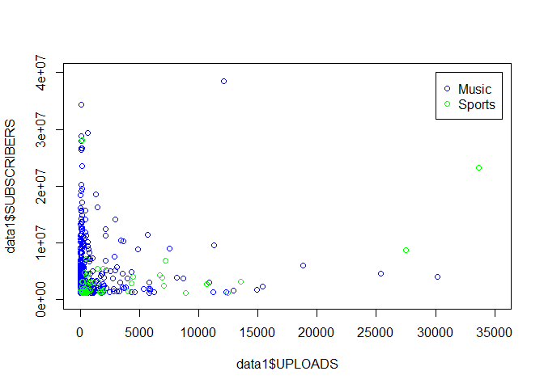
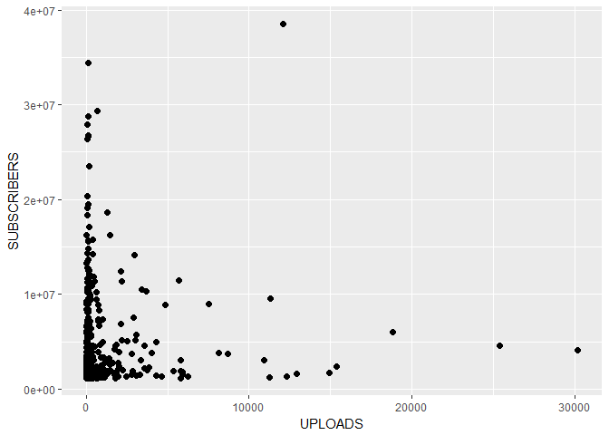
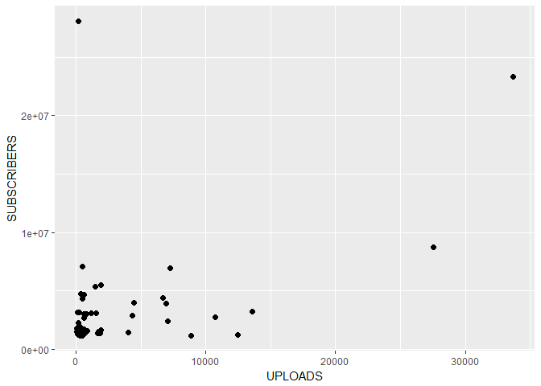
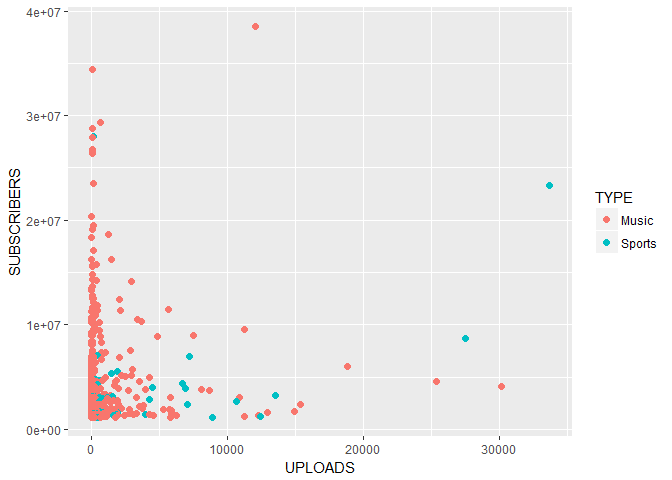

綜合討論
================

問題討論
--------

### 讀取資料檔

``` r
library(dplyr)
library(ggplot2)
youtuber = readRDS("20180507_files/youtuber.rds")
```

### 日期時間處理

先看看在沒有轉換為 Date 型態的情況下直接畫圖：

``` r
## 檢視變數型態
class(youtuber$CREATED)
```

    ## [1] "character"

``` r
## 散佈圖
youtuber[1:10,] %>%
  ggplot(aes(CREATED, UPLOADS)) +
  geom_point() +
  theme(axis.text.x = element_text(angle=30))
```



可以發現日期的排序並不合理，因此接下來使用 as.Date 函數進行型態的轉換。 (可查詢 ?strptime 檢視可用的日期格式設定)

``` r
## 轉換為 Date 型態
youtuber = youtuber %>%
  mutate(CREATED1 = as.Date(CREATED, "%m/%e, %Y"))

## 檢視變數型態
class(youtuber$CREATED1)
```

    ## [1] "Date"

``` r
## 散佈圖
youtuber[1:10,] %>%
  ggplot(aes(CREATED1, UPLOADS)) +
  geom_point() +
  theme(axis.text.x = element_text(angle=30)) +
  scale_x_date(date_breaks="6 month", date_labels="%B-%Y") 
```



### 多個圖形的堆疊

-   非 ggplot2 方法

``` r
## 音樂頻道
data = youtuber %>%
  filter(TYPE == "Music")

plot(data$UPLOADS, data$SUBSCRIBERS)
```



``` r
## 運動頻道
data = youtuber %>%
  filter(TYPE == "Sports")

plot(data$UPLOADS, data$SUBSCRIBERS)
```



``` r
## 透過 points, lines 等低階繪圖函數疊加多個圖形
data1 = youtuber %>%
  filter(TYPE == "Music")
data2 = youtuber %>%
  filter(TYPE == "Sports")

plot(data1$UPLOADS, data1$SUBSCRIBERS, col="blue", xlim=c(0,35000), ylim=c(0,40000000))
points(data2$UPLOADS, data2$SUBSCRIBERS, col="green")
legend(x=30000, y=40000000, legend=c("Music","Sports"), col=c("blue","green"), pch=1)
```



-   ggplot2 方法

``` r
## 音樂頻道
youtuber %>%
  filter(TYPE == "Music") %>%
  ggplot(aes(UPLOADS, SUBSCRIBERS)) +
  geom_point(size=2)
```



``` r
## 運動頻道
youtuber %>%
  filter(TYPE == "Sports") %>%
  ggplot(aes(UPLOADS, SUBSCRIBERS)) +
  geom_point(size=2)
```



``` r
## 透過 col, fill 等參數區分不同組別
youtuber %>%
  filter(TYPE %in% c("Music","Sports")) %>%
  ggplot(aes(UPLOADS, SUBSCRIBERS, col=TYPE)) +
  geom_point(size=2)
```


